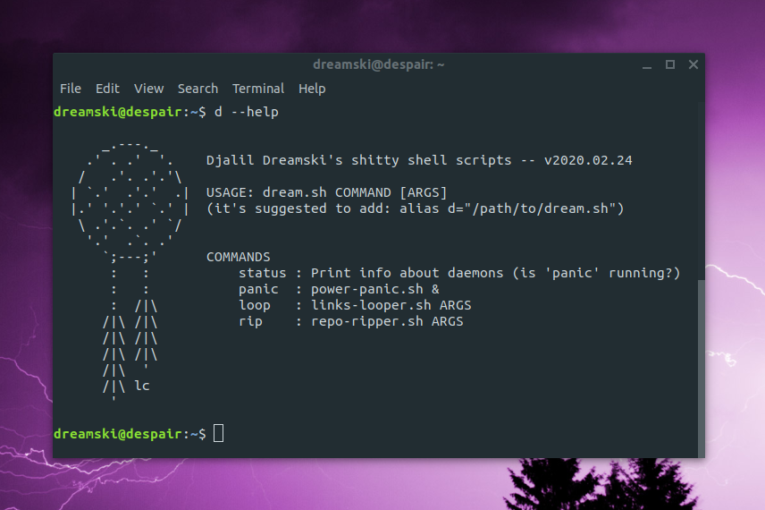

# Shall Not Despair
Some shell scripts I use to make my shitty computer and shitty internet a bit more bearable (_trying to not give in to despair/madness_)

**For a description of any command (_What? Why? And, maybe, how?_), check its script's comments.**

## License
CC-BY-4.0
